# tfc_private_module_azure_random_pet

This repository describes on how to create a repository in Azure DevOps and use this repository in Terraform Cloud Private registry as a module.

Steps involved:
- Create repository within Azure DevOps
- Create a VCS connection to Azure DevOps in Terraform Cloud
- Add the repository as a Private Module
- Use the Private module with Terraform CLI

# Prerequisites

## Login account for the following 
- Azure DevOps login
- Terraform Cloud login

## Install terraform  
See the following documentation [How to install Terraform](https://learn.hashicorp.com/tutorials/terraform/install-cli)

## Azure VCS connection from Terraform Cloud
Have a VCS connection to Azure from you Terraform Cloud organization. [Example how to](https://github.com/munnep/tfc_azure_vcs_connection/blob/main/README.md#create-a-vcs-provider-to-azure-devops)

# How to

## Azure DevOps
- Login to Azure DevOps portal
[https://dev.azure.com/](https://dev.azure.com/)
- create a new project    
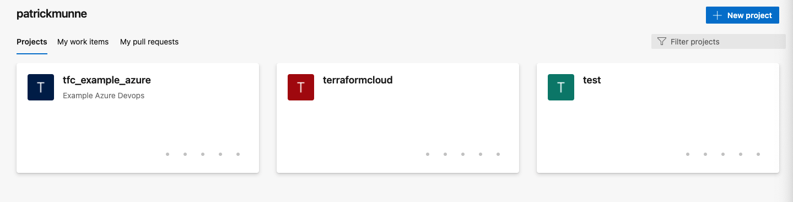  
- create the project `terraform-random-pet_azure`  
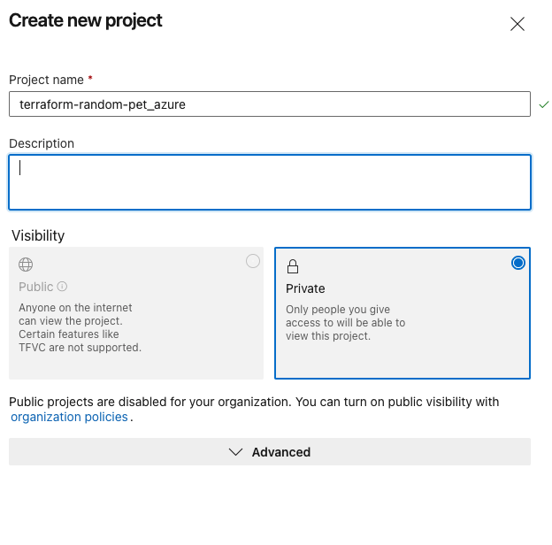  
- Create a repository    
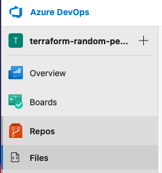   
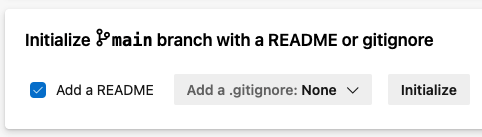  
- create a new branch    
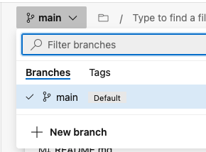  
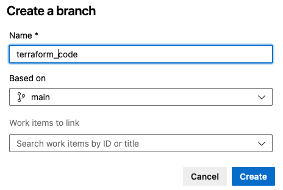  
- create a new file called `main.tf`.         
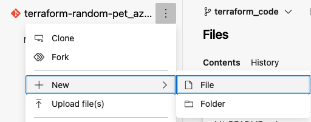  
```
resource "random_pet" "pet" {
    prefix = var.prefix
}
```
- create a new file called `variables.tf`.    
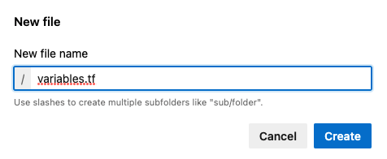  
```
variable "prefix" {
    type = string
    description = "prefix for the name of your pet"
    default = "blabla"
}
```
- create a new file called `outputs.tf`
```
output "pet" {
  value = random_pet.pet.id
}
```
- alter the `README.md`
```
# Private module terraform-random-pet_azure

This module will create a random name for you pet_azure

default prefix of the name is `blabla`

change the variable `prefix` in calling this module for a different prefix name
```
- Make a pull request    
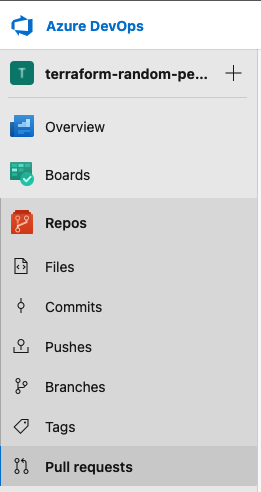  
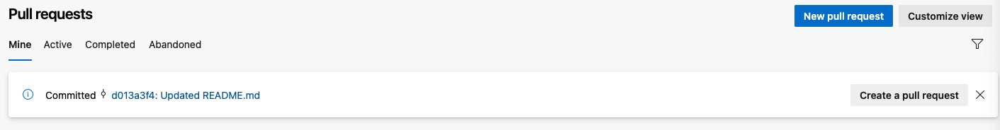  
- Give it a title   
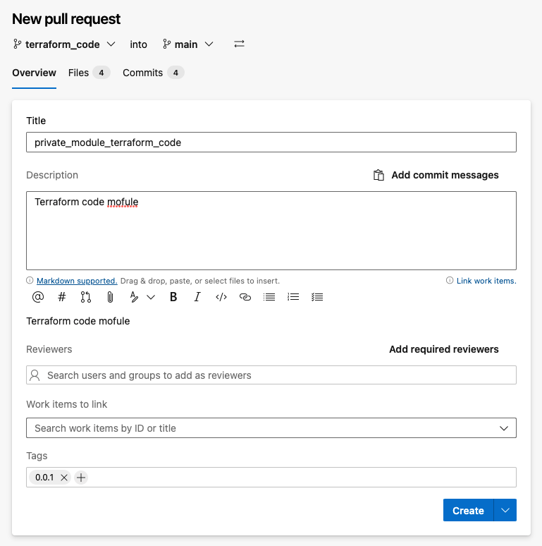  
- Click on complete    
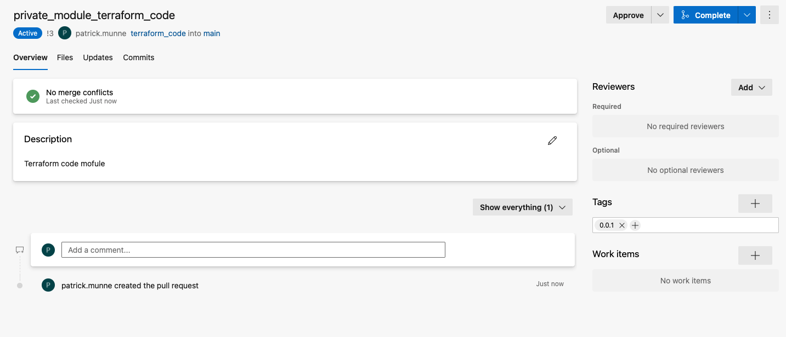    
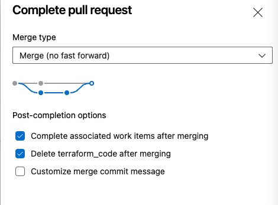  
- Create a tag on the `main` repostitory      
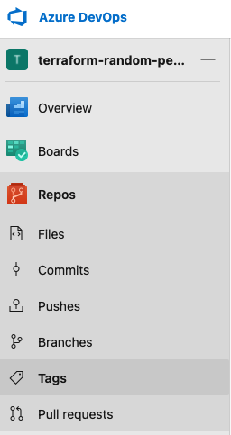  
- Create a tag `0.0.1`.     
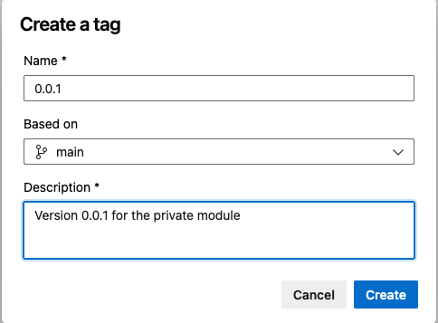  

## Terraform Cloud

- Login to Terraform Cloud
- Go to registry -> modules    
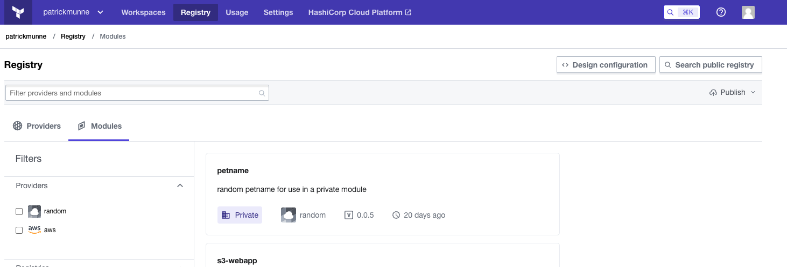  
- Publish a module      
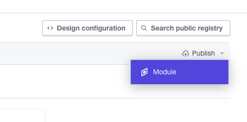  
- Click on your Azure DevOps connection you have    
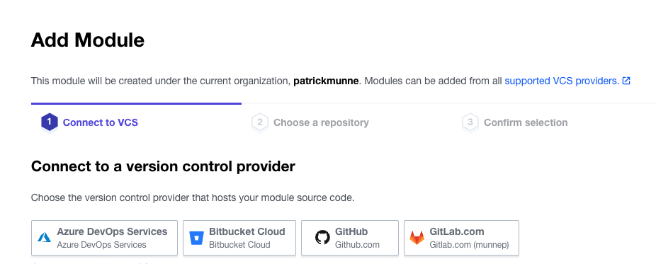  
- Select your module  
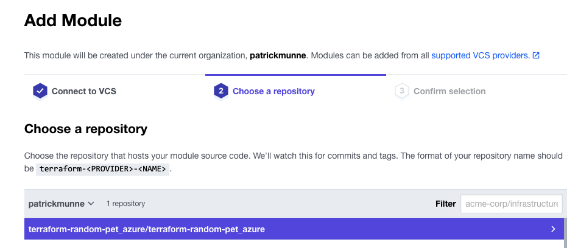  
- Publish module  
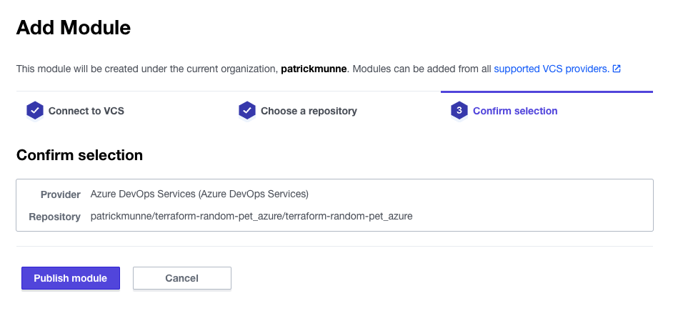  
- Your module should now be available for use    
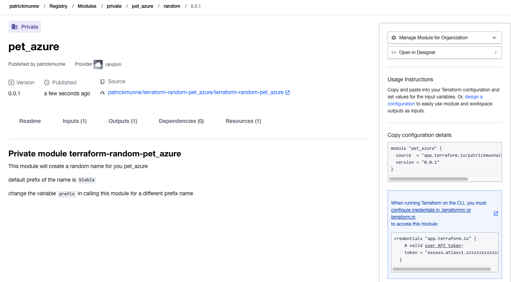   
- Example usage code
```
module "pet_azure" {
  source  = "app.terraform.io/patrickmunne/pet_azure/random"
  version = "0.0.1"
}
```

